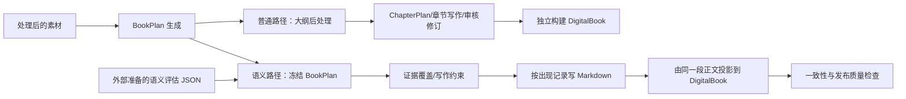

# 项目认知（只读审计初稿）

> 状态：2026-08-19。本文是依据当前 `main` 工作树、生产入口、关键测试和 Git 历史（`HEAD=3d2a5f0` 及其前序）形成的认知记录，不是设计方案，也不改变任何代码。  
> 约束来源：[PROJECT_INTENT.md](PROJECT_INTENT.md) 与 [ARCHITECTURE_GUARDRAILS.md](ARCHITECTURE_GUARDRAILS.md)。二者与本文观察有冲突时，以二者及后续产品确认优先。

## 1. 阅读范围与判断方法

已沿实际调用关系审阅以下生产关键部分：

- 根目录说明、运行脚本、`schemas`、`workflow/orchestrator.py`；
- 素材解析、规则与 LLM 两种 BookPlan 生成器、章节计划转换、标题/活动/案例处理、教材 writer；
- Markdown、DigitalBook、旧的跨项目精确重复替换；
- `knowledge_map`、证据覆盖、写作约束、渲染一致性、修复、物化、发布质量；
- 与真实工作流、BookPlan 不变量、语义书、物化、发布质量有关的测试及 fixture；
- Git 历史中 whole-book 生成演进提交（尤其 `45fbb03`、`4aebe64`、`70b5b48`）。

“原系统”在本文中指当前 `HEAD` 已提交的 whole-book 生成系统；知识轨迹代码主要仍是未提交工作树改动，因此 Git 中没有一个完整的“semantic 重构提交前后”边界可直接对比。

## 2. 原系统：从素材到一本教材的实际流程

### 2.1 正常入口

`scripts/run_topic_textbook.py`、`scripts/run_full_digital_textbook.py`、`scripts/run_agent_workflow.py` 都会调用 `TextbookWorkflow.run(...)`。它们把视频、PPT/文档等已经处理过的素材记录交给工作流；标准命令行没有“启动知识地图/知识轨迹分析”的参数。

### 2.2 素材与大纲

1. `ResourceAnalyst` 将输入记录适配为 `EvidenceChunk`（证据片段），并按状态、质量等筛选。
2. 生成 `BookPlan`：优先可用 LLM 的 `BookPlanLLMAgent`，否则使用规则 `BookPlannerAgent`；也可以由调用方直接传入现成大纲。
3. 在普通 whole-book 路径中，生成后的 `BookPlan` 仍会继续经过：
   - 最少任务数补齐；
   - 主要素材块覆盖补齐（可新增项目/章节）；
   - 按素材密度扩展或重组任务；
   - 章节证据补充；
   - 章节失败后过滤，并更新大纲 metadata。
4. `book_plan_to_chapter_plans` 将 BookPlan 变为 writer 使用的 `ChapterPlan`。这是另一份章节写作计划；它按 section 中 `knowledge_point_ids` 的既有次序铺开知识点。

### 2.3 章节正文与审核

1. 每章先由 `TitlePolisherAgent`、活动设计器、案例设计器调整 `ChapterPlan` 的标题、目标、知识点展示和活动/案例。
2. `TextbookWriterAgent` 根据 `ChapterPlan + EvidenceChunk` 一次生成章节 Markdown；无模型时用规则正文兜底。
3. 普通路径再经过证据/教学审核和 revision agent，形成章节最终稿；整书由各章最终稿拼接。

### 2.4 电子教材

`build_digital_book(...)` 基于 `BookPlan + ChapterPlan + EvidenceChunk` 独立搭建电子教材：项目导学、能力图谱、任务导航、情境、任务实施、案例、评价、练习、项目总结等。普通路径的 DigitalBook 并非从 Markdown 正文逐段复制，因此两端可各自生成内容。

旧的 `_replace_exact_cross_project_duplicates` 会对 DigitalBook 中跨项目完全相同的实施正文做“替换为交叉引用”；这是旧的段落级去重。若替换后内容失效，另有恢复交叉引用的逻辑。

## 3. 当前工作树：实际已具备的语义优化路径

### 3.1 已有能力

`knowledge_map/` 定义了一个旁路分析与受约束写作体系：

1. 从固定 BookPlan 的 section 与其指派素材中抽取源知识点；
2. 把同义或复合名称映射成可跨章节追踪的“规范知识点”；复合项可拆分为多个知识点；
3. 为每个知识点在全书的每一次出现建立记录，并推算此前教材已经提供了哪些教学内容；
4. 对每次出现判断它是初步认识、正式讲授、回顾、应用还是拓展，并生成“本次该教什么、不能重讲什么、只能使用哪些素材”的写作约束；
5. 在写作前做证据覆盖检查。无法由授权素材支持的目标会被收缩、丢弃或显式标记，而不是让 writer 补充常识；
6. writer 按“每次知识出现”生成正文，代码为每段加稳定锚点；DigitalBook 在语义模式下复用已生成的 Markdown 段落，以便两端同一知识出现的正文一致；
7. 对生成结果检查是否遵守写作约束、两端是否对齐、是否有发布质量问题。

其中所谓“此前已经提供”，指教材在前面章节是否已经讲过相关内容，不等价于真实学生已经掌握。

### 3.2 实际接入方式

当前 `TextbookWorkflow.run(...)` 有 `semantic_evaluation_input` 参数。调用方必须先准备一份已经完成的语义评估 JSON；工作流读取它，构建写作约束并走证据覆盖、受约束 writer、DigitalBook 对齐和发布质量检查。

但以下两个关键步骤**没有被标准脚本或 `TextbookWorkflow` 自动调用**：

- `analyze_book_knowledge(...)`：从 BookPlan 建知识地图；
- `evaluate_semantic_planning(...)`：调用语义 planner、合并被接受的同义知识点、生成最终的各次出现计划。

换言之，当前标准 CLI 仍走原系统；要走语义路径，外部调用者必须自行先运行/提供评估产物。这是“有能力”与“已成为默认生产流程”的重要区别。

### 3.3 语义路径中的 BookPlan 处理

当 `semantic_evaluation_input` 存在时，编排器在刚取得 BookPlan 后保存快照、签名和指纹，并跳过上述普通路径中的最少任务、素材覆盖、任务密度和章节证据等 BookPlan 后处理；导出前后都会做 deep-equal 检查。

知识出现记录只引用既有 `chapter_id / section_id`。规范知识拆分不会创建新 section。`DisplayMetadata` 也以 `outline_node_id` 关联，未写回 BookPlan。这些部分符合“语义层只能做 overlay”的方向。

## 4. 两条链路的真实关系



现状不是“原系统被完全替换”，而是两条路径并存：普通路径保留旧的审核、revision、独立 DigitalBook 写作和段落级去重；语义路径跳过其中一些环节，以受约束的 occurrence 正文替代它们。

## 5. 真实 ownership（谁实际决定什么）

| 对象/结果 | 当前实际 owner | 观察 |
| --- | --- | --- |
| 原始素材文本 | 输入数据与 `ResourceAnalyst` | 会转成/清洗为 EvidenceChunk。 |
| BookPlan 初稿 | `BookPlanLLMAgent`、`BookPlannerAgent` 或外部输入 | BookPlan 是目录、任务、知识点归属和素材归属的正式载体。 |
| 普通路径最终 BookPlan | BookPlan 生成器 + 后续 normalizer | 后处理可增章、补任务、重组任务、更新 metadata。 |
| 语义路径 BookPlan | 语义模式入口处的快照 | 代码意图是其后不再改变，并有 deep-equal 守卫。 |
| 章节写作计划 | `book_plan_to_chapter_plans`，再经标题/活动/案例 agent | 它不是 BookPlan 本体，但 writer 实际消费它。 |
| Markdown 正文 | `TextbookWriterAgent` | 普通模式按章生成；语义模式按 occurrence 生成并由代码加锚点。 |
| DigitalBook 正文 | 普通模式：DigitalBook exporter；语义模式：优先采用 Markdown occurrence 正文 | 项目导学、案例、评价、练习等其他 DigitalBook 组件仍由 exporter 独立构造。 |
| 全书知识轨迹/教学职责 | `knowledge_map` + 外部 semantic evaluation 产物 | 当前不是标准工作流自动 owner。 |
| 修复与最终物化 | 各 `knowledge_map` 模块 | 模块与测试存在，但未接入 `TextbookWorkflow` 或标准脚本。 |

## 6. 证据如何流转、如何授权

1. 素材被转为 `EvidenceChunk`；每个 BookPlan section 有 primary/reference material IDs，章节也有自己的素材归属。
2. 知识地图抽取源知识点时，目前以**section 的** primary/reference IDs 作为其来源证据。
3. 语义评估可提出当前知识点和本次教学目标所需的证据；证据覆盖层再从规范知识的来源、拆分继承来源和当前任务上下文允许的素材中绑定候选证据。
4. writer 的 occurrence brief 只带已授权 `source_chunk_ids`；其 prompt 要求只使用这些素材。
5. 写作前的证据门检查计划是否有授权依据；写作后的发布质量检查还会检查渲染正文中可能的素材事实。

需注意：当前 `rendered_evidence_verification.py` 是确定性、词法/短语层面的核验。此前单独进行过的 Qwen “正文事实语义蕴含审计”是运行产物/一次性审计，不是这个标准编排器中自动执行的步骤。

## 7. Markdown 与 DigitalBook 的真实关系

- 普通路径：两端各自生成，旧去重只作用于 DigitalBook 的实施正文。
- 语义路径：每个受约束 occurrence 的 Markdown 由代码加锚点；导出器以 occurrence ID 把同一正文放入 DigitalBook 的对应实施块。一个 outline section 可以承载多个 occurrence，但不会因此增加 outline node。
- 两端对齐检查只覆盖有 occurrence anchor 的实施正文；项目导学、导航、案例、评价、练习、总结等非 occurrence 组件仍独立产生，因而不天然等同于 Markdown 正文。

## 8. repair 与 publication gate 的真实位置

`repair_proposals`、安全删除型修复、受控生成 patch、回顾胶囊与 `materialize_full_book` 都实现了单元级闭环及审计测试。它们能在测试中保证不改 BookPlan、上游教学判断和两端一致。

但在当前生产调用链中，`TextbookWorkflow` 并未调用这些 repair/materialization 函数。它现在实际调用的是：写作约束覆盖 → 章节写作 → DigitalBook 导出 → 语义书一致性检查 → publication quality。故“完整闭环已在模块层实现”与“标准生产入口已完整执行修复/物化”不能混为一谈。

## 9. 测试、fixture 与生产隔离

- `tests/fixtures/knowledge_map_gold/`、`phase2b5_real_trajectories.json`、`tests/fixtures/publication_regression/` 仅被测试读取；对 `src/` 与 `scripts/` 的全文扫描未发现它们的路径、ID 或标题引用。
- `test_book_plan_invariants.py` 还显式断言 production workflow 源码和由 `analyze_book_knowledge` 产生的数据中不含 Phase 2B.5 fixture identity。
- 因此目前未发现 fixture 直接流入生产调用链的证据。

## 10. Git 历史所显示的演进

- `70b5b48` / `5391e08`：建立项目—任务教材结构、领域配置、whole-book 规划与本地素材流程。
- `45fbb03` / `4aebe64`：增强 whole-book 规划、BookPlan 后处理、DigitalBook delivery、跨项目精确内容去重。
- 当前知识轨迹、证据门、occurrence writer、对齐与发布质量代码主要处于未提交工作树；Git history 中尚无法找到一条完整的 semantic/full-book optimization 重构提交。

## 11. 与 PROJECT_INTENT / ARCHITECTURE_GUARDRAILS 的符合点

1. 语义模式下保存 source BookPlan 快照、签名、指纹，并在末端 deep-equal；
2. occurrence 用既有 outline node 做 overlay，拆分知识点不新建目录；
3. 计划的语义事实与确定性排序/状态/角色推导分开；
4. writer 接受不可自行改写的写作约束；
5. 证据不足会收缩/拒绝，而非直接扩授权素材；
6. occurrence 的 Markdown/DigitalBook 映射使用稳定 ID，并在语义路径关闭旧的跨项目精确段落去重；
7. fixture 与生产代码目前已隔离；
8. 修复模块的设计本身将上游决策视为不可变，并要求双端复核。

## 12. 可能偏离稳定目标或需要进一步确认的地方

### 12.1 标准生产流程尚未形成一个完整闭环

标准脚本不会自动从 BookPlan 建知识地图、调用 semantic planner、再把结果交给 writer；repair/materialization 也未接入编排器。这意味着当前系统存在“可被手工串联的语义能力”，但尚不能证明“任意正常生成一本教材都会自动执行完整闭环”。这与“可发布、可审计的产品流程”存在明显风险。

### 12.2 同一 frozen BookPlan 不是普通 baseline 与语义模式的默认共同输入

普通路径会在 BookPlan 初稿后继续结构性处理；语义模式则在其前冻结并跳过这些处理。只有专门的 A/B 调用显式传入同一 `source_book_plan.json` 时，才能保证两边真的相同。标准 CLI 没有把这件事作为默认行为。

### 12.3 可见目录标题仍可能从辅助 ChapterPlan 改变

语义模式不改 BookPlan，但仍调用 `TitlePolisherAgent` 修改 writer 消费的 `ChapterPlan` 标题、目标和知识点展示，且可能合并重复知识点。技术上 BookPlan deep-equal 会通过；产品上，学生看到的标题/任务呈现是否仍应逐字等同于冻结 BookPlan，需要确认。

### 12.4 “通用教材”与现有领域专用规则不一致

`BookPlannerAgent` 有 `DEFAULT_WELDING_CHAPTER_ORDER`；`BookPlanLLMAgent` 的任务工作流模板、`TitlePolisherAgent`、`CaseDesignerAgent` 也含焊接关键词、焊接专用标题或 ASR 词典。即使 `DomainConfig` 允许配置领域，缺省与若干回退逻辑仍带有焊接假设。这不符合“焊接仅是历史样本、机制应通用”的稳定产品目标。

### 12.5 章节内“逻辑优化”目前主要改变讲法，未明确允许重排

当前代码保留 `BookPlan` 中 section 和知识点的原始次序；语义层通过减少重讲、要求应用/拓展/回顾来改变各段写法，但没有明确的“在不改变目录的前提下重排 section 内知识点讲述顺序”机制。是否应有此能力，是本轮首先需要产品确认的问题。

### 12.6 授权证据范围可能过窄或与章节所有权不完全一致

知识地图的源知识点目前只从 section primary/reference IDs 取证；而 BookPlan 还支持 chapter-level primary/reference 和推荐视频。哪些属于某次 occurrence 可授权来源是产品规则，不应由我在未确认前擅自扩大。

### 12.7 旧逻辑仍并存

普通路径仍有独立 DigitalBook 正文生成、旧段落精确去重、旧 review/revision；语义模式为保留 occurrence 正文的可审计性而跳过这些 revision。两者共存会使“当前真实生产行为”随入口不同而不同。

## 13. Standard Outline 并行开发审计（work-manuscript）

本节来自远端 `/ai/data/repos/work-manuscript` 的只读检查。该工作树当前分支是 `manuscript`，状态为：

- `src/materials2textbook/outline/` 为未提交新增目录；
- `tests/test_standard_outline.py` 为未提交新增测试；
- `src/materials2textbook/exporters/digital_book.py` 为未提交修改；
- 未把这些改动合并到当前 `main` 工作树，也未修改当前本地生产代码。

### 13.1 输入与输出

`generate_standard_outline(book_json)` 的输入是已经构建好的 **DigitalBook JSON 对象**，具体读取：

- `projects[]`：作为项目层；
- `projects[].tasks[]`：作为任务层；
- `tasks[].blocks[]`：作为“学习单元”层；
- 各节点自己的 `project_id / task_id / block_id` 与 `title`。

它不读取原始素材，不调用 LLM，不读取 BookPlan 的 `chapters / sections / knowledge_point_ids / primary_material_ids`，也不读取语义 overlay。它只按 DigitalBook 数组当前顺序建立：

```text
DigitalBook project → standard_outline project
DigitalBook task    → standard_outline task
DigitalBook block   → standard_outline learning_unit
```

输出是一个 `Outline` 展示/校验模型，包含 `source_node_id`、数字路径、格式化显示编号和标题。它没有正文、知识点归属或素材归属字段。

### 13.2 它是否生成新的 production outline

从代码事实看，它不是新的 BookPlan，也不是 LLM 重新规划的大纲，而是 DigitalBook 的只读投影：

1. `export_digital_book()` 先调用既有 `build_digital_book(...)`；
2. 生成完整 DigitalBook 后调用 `generate_standard_outline(book)`；
3. 再调用 `validate_outline(outline, book)`；
4. 将两个结果作为 `standard_outline`、`outline_validation` 写入 `digital_book.json`；
5. 网页端从 `book.standard_outline` 渲染“教材大纲”页。

因此，当前实现没有证据表明 standard outline 会成为新的 production outline，也没有证据表明它会反向写回 BookPlan。

### 13.3 对已有 BookPlan 的影响

就这批改动本身而言，没有直接修改 BookPlan 的代码。它不会改变：

- chapter/project 数量或顺序；
- section/task 数量或顺序；
- BookPlan 标题、编号、knowledge point 列表；
- primary/reference material ownership。

但有一个重要的投影风险：standard outline 不从 BookPlan 投影，而从 DigitalBook 投影。DigitalBook 的项目和任务标题来自 `ChapterPlan`/DigitalBook 构建结果，学习单元标题来自 DigitalBook block。若这些辅助对象与冻结 BookPlan 不一致，standard outline 仍会忠实呈现 DigitalBook 的差异，校验只会报告错误，不会把它还原为 BookPlan。

### 13.4 大纲生成器、标题建议、格式化与校验的真实职责

- `outline/generator.py`：确定性转换和编号生成。以数组顺序为准，不重排、不补节点、不改标题。
- `outline/formatter.py`：只格式化“项目一 / 任务1-1 / 学习单元1-1-1”等显示编号。
- `outline/validator.py`：只读检查数量、来源 ID、层级、编号连续性、标题一致性、内部标签泄漏和重复/父子标题问题。它返回 error/warning，不修改输入对象。
- `outline/title_suggester.py`：根据当前 DigitalBook 节点标题与该节点已有内容，生成标题建议和人工复核行。它不写回标题，不调用 LLM；建议带置信度和 `needs_human_review`，属于审阅结果，不是 production title。

未发现 formatter、validator 或 title suggester 对 BookPlan、DigitalBook 或正文进行 normalization/repair mutation。它们的 mutation 集合为零；唯一的写入是 exporter 把新生成的投影和报告写进 JSON 文件。

### 13.5 DigitalBook 中新增“教材大纲”的实际行为

它是学生端展示内容，加入网页目录和正文的“教材大纲”区块。它不参与 DigitalBook 项目/任务/正文的生成，因为它在 `build_digital_book()` 完成之后才生成。

校验失败时，前端只在 `renderBook()` 中 `console.warn(...)`，并仍然执行渲染；`preview_allowed` 没有被前端用来阻止预览。`release_allowed` 也没有在这段 exporter/前端代码中接入 production publication gate。因此它目前是展示与诊断字段，不能据此断言会阻止正式发布。

### 13.6 与当前对象的关系

| 对象 | 与 standard_outline 的实际关系 |
| --- | --- |
| `BookPlan` | 上游参与 DigitalBook 的构建和 metadata 保存，但 standard outline 不直接读取其章节/section 结构。 |
| `SemanticOverlay` / occurrence | 当前 standard outline 不读取，也不展示 occurrence；它只看到 DigitalBook 的 block。一个 section 下多个 occurrence 如何映射，不由该模型表达。 |
| `DisplayMetadata` | standard outline 没有使用 `DisplayMetadata`；它直接采用 DigitalBook 节点标题。 |
| `DigitalBook outline` | `standard_outline` 就是对 DigitalBook projects/tasks/blocks 的另一种标准编号和展示模型，写回同一个 DigitalBook JSON。 |

### 13.7 并行开发风险

1. **ownership 语义分裂风险**：BookPlan 是当前产品意图中的固定目录来源，但 standard outline 的实际数据源是 DigitalBook；两者如果标题或节点数量发生漂移，标准大纲会显示漂移后的 DigitalBook，而不是冻结 BookPlan。
2. **层级定义不一致风险**：当前 standard outline 的最低层是 DigitalBook block，命名为 learning unit；当前 BookPlan 的最低层是 section/knowledge points。二者不是同一层级，不能直接用 standard outline 的节点数证明 BookPlan 未变。
3. **展示与发布边界未闭合**：校验报告有 `preview_allowed/release_allowed`，但当前前端和 exporter 没有将其接入发布 gate；“校验失败阻止预览/发布”目前只是模型字段和测试契约，不是完整 production 行为。
4. **领域特化风险**：标题建议器包含大量焊接词条和焊接场景规则；这批代码因此尚不能直接视为通用教材的标准大纲解决方案。

## 14. 当前最关键的产品歧义（待确认）

### 14.1 Standard Outline 合并前需要确认的边界

这批并行代码没有直接改 BookPlan，但它引入了一个新的“教材大纲”展示模型，而且该模型从 DigitalBook 而不是 BookPlan 读取结构。因此在继续确认“固定 BookPlan 到什么粒度”之前，需要先明确：产品是否允许学生端展示大纲与 BookPlan 使用不同的结构层级，还是学生端大纲必须是冻结 BookPlan 的只读投影。

### 14.2 原先暂停的问题是否受影响

会受影响。原问题不能再只问“同一 section 内 knowledge points 能否重排”，还必须先确认学生端 `standard_outline` 的权威来源：

> 你希望固定 BookPlan 作为唯一的目录权威，standard outline 只能把 BookPlan 的 chapter/section/task 原样投影到学生端；还是允许 standard outline 以 DigitalBook 的 project/task/block 结构单独作为展示层？如果允许两者并存，学生看到的目录与 BookPlan 不一致时，哪一个代表产品上的“固定大纲”？

在这个问题确认前，不应把 standard outline 合并到语义优化链，也不应根据它决定 section 内知识点顺序是否可调整。

## 15. 已确认的 StandardOutline 产品 ownership

本节记录产品层已经确认的边界，优先级高于前文对 standard outline 的暂时推断。

### 15.1 两种“大纲”的产品定义

当前项目明确区分：

```text
generation planning outline = BookPlan
rendered/student outline    = StandardOutline
```

- **BookPlan** 是教材生成前的规划 source of truth。
- **StandardOutline** 是基于最终 DigitalBook 生成的标准化成品大纲和学生端导航展示。
- StandardOutline 不参与 BookPlan generation、semantic planning、knowledge trajectory、occurrence role、evidence ownership 或 writer planning。
- StandardOutline 不作为判断 semantic optimization 是否修改 BookPlan 的依据。
- BookPlan preservation 继续由 frozen BookPlan snapshot、structural validation 和最终 deep-equal 负责。

正式生产关系因此是：

```text
Evidence / Materials
        ↓
原有 BookPlan Generator
        ↓
BookPlan（生成规划 source of truth）
        ↓
Semantic Optimization / Chapter Writing
        ↓
Markdown + DigitalBook
        ↓
StandardOutline（成品结构/学生端导航展示）
        ↓
展示层结构校验
```

### 15.2 StandardOutline 的职责边界

StandardOutline 按 work-manuscript 当前方向负责最终 DigitalBook 的：

- 项目、任务、learning unit 展示；
- 展示编号；
- 学生端教材大纲；
- 展示层结构校验。

暂不要求 StandardOutline 表达或承担：

- material ownership；
- evidence scope；
- learning goals；
- semantic occurrence；
- knowledge trajectory；
- writer planning；
- BookPlan 是否被修改的判定。

### 15.3 work-manuscript standard outline 能力的重新归类

当前可直接保留为成品 StandardOutline 的能力：

- `Outline` 节点模型的层级表达方式；
- stable `source_node_id`、`number_path`、格式化编号；
- 确定性编号 formatter；
- 节点数量、顺序、编号连续性、标题一致性的 validator 思路；
- 重复标题、父子标题和内部标签泄漏的诊断规则（需明确其属于哪个发布阶段）。

应重新定位为 RenderedOutline / StudentNavigation 的能力：

- 当前从 `DigitalBook.projects/tasks/blocks` 反推 outline 的 `generate_standard_outline()`；
- 将 block 作为 `learning_unit` 展示节点；
- 网页端“教材大纲”区块和 TOC；
- 对最终 DigitalBook 实际节点做显示层的结构检查。

应继续排除出通用 StandardOutline 设计的 welding-specific 能力：

- 标题建议器中的焊接术语匹配表；
- 针对焊接工艺、缺陷、焊条、氩弧焊等内容的固定标题推断；
- 依赖焊接案例或焊接素材形态的特殊命名规则。

### 15.5 对“固定大纲”问题的影响

StandardOutline 不再参与“固定 BookPlan 到什么粒度”的判定。该问题只围绕 BookPlan snapshot 和 semantic overlay 的边界确认。

在 BookPlan 保持不变的前提下，仍需单独确认：同一 section 内既有知识点在最终正文中的讲述顺序允许优化到什么程度。

## 16. 已确认的章节内正文教学顺序边界

产品已确认选择“受约束的正文教学顺序优化”，而不是自由重排。

### 16.1 冻结内容

- BookPlan 中 knowledge point 的列表、归属和原始顺序保持不变；
- 不回写、不重排 BookPlan；
- 一个知识点不能跨 section 移动；
- 不能因为语义去重增加或删除 BookPlan 中的知识点；
- 某知识点在当前位置由完整 TEACH 改为 APPLY、RECALL 或 EXTEND，属于讲法变化，不是从 BookPlan 删除知识点。

### 16.2 允许的变化

Semantic Optimization 可以在同一个 section 内建立单独的 `rendered teaching order` / semantic overlay，用于组织最终正文的教学叙事。例如 BookPlan 顺序为 `K1 → K2 → K3`，正文可以在满足约束和教学收益的情况下写成 `K2 → K1 → K3`，但 BookPlan 仍保持原顺序。

该顺序调整属于正文写作组织，不属于目录结构变更，也不进入 StandardOutline 的 ownership。

### 16.3 不得违反的硬顺序

存在以下语义时不得重排：

- 操作步骤；
- 实验流程；
- 时间顺序；
- 工作流顺序；
- 因果链；
- 明确 prerequisite；
- 数学推导顺序。

### 16.4 重排的必要条件

只有存在明确教学收益才允许调整。合理理由包括：

- 先前置概念、后应用；
- 先总览、后细节；
- 先解释原因、后给操作；
- 在真正使用已有知识前放置必要 recall；
- 避免刚教完一个知识后被其他知识打断，再回来重复完整教学；
- 让 TEACH → APPLY → EXTEND 的局部叙事更自然。

如果原顺序已经合理，应保持原顺序。全局去重不能成为重排的唯一理由；降低重复只能是教学顺序改善后的附带收益。

### 16.5 审计要求

当正文顺序不同于 BookPlan 顺序时，必须在 overlay / writing organization 中记录：

- `original_order`；
- `rendered_teaching_order`；
- `reorder_reason`；
- `hard_order_constraints_checked`。

这些记录不能写回 BookPlan，也不能改变正式目录和知识归属。

## 18. 已确认的 occurrence 与 rendered span 边界

产品已确认：Occurrence 必须始终可审计，但不要求始终拥有独立的学生可见正文块。

### 18.1 两种不同粒度

```text
semantic occurrence
= 系统理解某个知识在当前位置出现，并记录其教学职责与审计信息

rendered span
= 最终教材为了当前教学需要实际写出的学生可见内容范围
```

两者不是一一对应关系：

- 多个 occurrence 可以合并到一个自然连续的 rendered passage；
- 一个 occurrence 可以只有内部语义记录，没有学生可见正文；
- rendered span 可以通过内部 span/anchor/mapping 同时对应多个 occurrence；
- anchor 不必暴露给学生，但必须能追溯到 occurrence、outline node 和语义决策。

### 18.2 条件式渲染策略

同一 canonical knowledge 再次出现时，按当前位置的实际教学职责决定：

- 有新的 facet 或 extension：保留对应新增教学内容，通常是 TEACH / EXTEND；
- 没有新增内容但当前任务确实使用它：保留最小 APPLY 内容，说明旧知识如何服务当前任务；
- 没有新增内容但确实需要恢复前文上下文：保留最小 RECALL 内容；
- 没有新增内容、当前任务不使用、不需要回忆、也不承担必要过渡：允许 rendered text = none。

“rendered text = none”不是删除知识点，也不是修改 BookPlan；必须保留 semantic occurrence、outline node association、canonical knowledge association 和不渲染理由，不能静默消失。

### 18.3 对全文连续性的含义

学生不需要看到每个 occurrence 的独立段落。系统应优先形成自然连续的教材正文，同时保留内部可审计映射，能够回答某个句子或 span 对应哪些 occurrence，以及某个不渲染 occurrence 为什么在当前位置不需要表达。

## 19. 已确认的“教学支持—任务使用—学生模块”闭合原则

产品已确认：教学支持是全书范围闭合的，不要求每个 section 自包含。

### 19.1 occurrence 不渲染的含义

一个 occurrence 没有学生可见正文，只表示当前位置不需要再次教学这个知识，不表示当前任务不能使用、练习或评价前文已经教过的知识。

判断顺序是：

```text
occurrence 不渲染
        ↓
当前任务是否真实需要该知识？
    ├─ 否 → 正文不写，导航/评价/练习也不应机械引用
    └─ 是
        ↓
前文是否提供了足够教学支持？
    ├─ 是 → 可直接作为已学知识使用，不要求本 section 重复教学
    └─ 否 → 不能直接评价/练习，需补足教学或报告教学—评价不闭合
```

### 19.2 “足够教学支持”不是简单出现过

判断依据不是“知识点前面出现过”，而是前文提供的教学程度是否足以支撑当前任务要求：

- 只介绍概念，不等于可以直接要求复杂操作；
- 已教过操作方法，通常可以在后文直接要求应用；
- 当前评价要求的能力不能超过前文实际提供的教学程度。

### 19.3 学生可见模块的职责

- 导航可以提醒学生调用前文知识，但不能声称本节会重新系统教学一个实际上不渲染的知识；
- 任务评价可以评价当前任务对已学知识的实际应用；
- 思考与练习可以练习或应用前文已经充分教学的知识，但不能引入尚未教学的新能力要求；
- 如果当前任务不需要该知识，相关导航、评价、练习也不应为了保留 occurrence 而机械引用它。

因此，评价/练习的合法性取决于“此前是否已经提供足够教学 + 当前任务是否真实需要”，而不是取决于当前 occurrence 是否有独立正文。

## 20. 已确认的跨 canonical knowledge 去重边界

全书去重既处理同一 canonical knowledge 的重复教学，也允许处理不同 canonical knowledge 之间可证明的共享教学事实；但后者必须采用更严格的证明条件。

### 20.1 三种产品关系

- **SAME**：同一个 canonical knowledge 的多次 occurrence，可以直接使用知识轨迹判断 TEACH / APPLY / RECALL / EXTEND。
- **RELATED_WITH_SHARED_FACTS**：不同 knowledge，但共享一部分可证明的教学事实。可以压缩共享事实，但必须保留各自独立的新贡献。
- **DISTINCT**：即使语言相似，也分别教学，不因文本相似去重。

### 20.2 跨知识压缩的对象

跨知识去重的粒度是 `shared instructional fact`，不是整个 knowledge point：

```text
A != B
shared facts: F1, F2
A-specific: ...
B-specific: F3, F4
```

允许压缩的是已经证明由 A/前文充分教学的 F1、F2；B 的场景差异、新约束、新机制、新应用和其他独立贡献仍必须保留。

不能因为 A、B 都出现“定义、作用、步骤”，或因为文本相似、关键词重叠、embedding similarity 较高，就认定它们重复。

### 20.3 四项必要条件

跨知识压缩至少需要同时证明：

1. 明确指出共享的具体教学事实，而不是只说两者相似；
2. 共享事实在前文已经获得足够教学支持，`appeared before` 不等于 `sufficiently taught before`；
3. 压缩后 B 仍能在当前语境下理解，必要时保留桥接句和场景解释；
4. B 的独立教学贡献仍然存在。若 B 压缩后没有任何独立贡献，应先检查 canonicalization 或 BookPlan 规划是否有问题，不能靠删正文掩盖。

### 20.4 审计要求

跨知识压缩必须能追溯：

- 当前被压缩的 shared fact；
- 支撑它的 prior knowledge / occurrence；
- 前文已经教学该事实的 rendered span；
- 当前 B 保留的独立贡献；
- 为什么当前不需要再次完整解释。

不得因为相似度高而静默删除，也不得合并知识身份、改变 knowledge ownership 或删除后者的独立教学目标。

## 21. 已确认的教学支持可用性来源

前文“计划教过”不能作为后文压缩或 availability 的依据：

```text
planned TEACH
    ≠ available teaching

实际学生可见 rendered content
    + 与当前教学职责相关的局部 conformance 验证
    + evidence 验证
    → 才能建立后文可依赖的教学支持
```

不要求整个教材先完成最终 publication 才能供后文使用，否则会形成生成依赖循环。前文 occurrence 只要已经完成实际渲染并通过局部验证，就可以为后续 occurrence 提供教学支持；最终 publication 仍需再次执行全书范围验证。

不同事实类型是否需要不同验证等级暂不在产品层继续细分，待实现和真实测试暴露出必要性后再确认。

## 22. 当前代码与已确认目标的实现差距（2026-08-21 更新）

本节是基于当前工作树和真实调用链的只读审计；本轮没有修改 production code。此前记录的 Phase 1、Phase 2、Phase 3A、Phase 3B 能力已完成并关闭，不再作为 gap 重复列出。

**状态更正：22.1–22.5、22.7 中的旧“尚未实现”表述已被当前代码和验收结果取代；真正剩余的入口、发布门禁和审计问题见 22.6、22.8–22.10。**

### 22.0 当前状态覆盖（优先于下方历史快照）

| 能力 | 当前事实 |
| --- | --- |
| verified runtime availability | 已接入顺序执行；只由已渲染、局部 conformance 通过且 evidence 通过的结果授予；planned simulation 仅作诊断。 |
| ZERO_RENDER | 已是一等、可审计执行结果；不授予 availability；真实样本是否触发不影响能力已实现的判断。 |
| coherent passage | 已在 section discourse 层接入；相邻 occurrence 可组成连续学生正文，同时保留 occurrence 审计边界。 |
| rendered teaching order | Phase 2 benchmark 未发现实际需要，当前不实现。 |
| RELATED_WITH_SHARED_FACTS | 已完成受控审计和单个 COMPRESSIBLE 案例物化；contextual cases 仍 fail-closed。 |
| downstream closure | 已生成 location-aware 只读报告，并已接入 semantic materialization 的 final publication gate；缺失、未支持和阻断状态会 fail-closed。 |
| title ownership | semantic path 已跳过 TitlePolisher；legacy 非 semantic path 仍可能润色 ChapterPlan。 |
| standard production path | `run_full_digital_textbook.py` 与 `run_topic_textbook.py` 当前默认启用 semantic-book；可用 `--no-semantic-book-mode` 显式回到 legacy/诊断路径。 |
| remaining wiring | 外部 semantic payload 仍是显式 replay 路径而非 verified runtime；`run_agent_workflow.py` 仍是 legacy chapter-only 入口；repair/recall/generated patch 仍保持显式 opt-in。 |

下方 22.1–22.5、22.7 的原文保留为 2026-08-19 历史审计快照，仅用于解释当时为何实施这些能力，不再作为当前 gap 结论。

### 22.1 [历史快照] 教学支持状态仍以计划为主，而非已验证渲染结果

当前 `knowledge_map/availability.py` 主要依据 `PlannedOccurrence` 的 `trusted_for_state`、`intended_grants` 和前置条件推进可用状态。它验证的是“计划上会提供哪些教学 facet”，不是“前文学生可见正文已经提供且通过局部 conformance/evidence 验证”。

与已确认目标的差距：

- 前文 planned TEACH 仍可能直接建立后文 availability；
- 渲染后 conformance 结果没有作为后续 occurrence 状态转移的唯一输入；
- 没有明确的“rendered + locally verified → available”状态转移闭环；
- 计划、渲染和验证之间的中间状态仍混在同一条 availability 分析链中。

### 22.2 [历史快照] occurrence 当前默认要求有独立 rendered body

现有 WritingBrief、rendered conformance、semantic book conformance 和 alignment 逻辑主要按“一条 brief 对应一段带 anchor 的正文”设计：

- coverage 中的 brief 通常要求有 Markdown/DigitalBook occurrence anchor；
- semantic gate 将 occurrence anchor coverage 视为完整覆盖条件；
- conformance checker 以 brief 对应 body 检查必须教学内容和禁止重讲；
- DigitalBook 对齐逻辑按 occurrence ID 找一段实施正文。

与已确认目标的差距：

- 合法的 `rendered text = none` 尚未成为一等状态；
- “不渲染但任务可以使用前文知识”与“证据拒绝/丢弃教学目标”没有稳定区分；
- 当前 100% anchor 规则不能直接套用于允许不渲染 occurrence 的产品定义。

### 22.3 [历史快照] 多 occurrence 合并为一个自然段尚未成为正式模型

当前代码的 anchor 与 extraction 更接近一个 occurrence 一个 span。虽然可以把多个 occurrence 的内容写在相邻正文中，但没有正式表达：

- 一个 rendered span 对应多个 occurrence；
- 一个 occurrence 没有 span；
- 一个 span 中不同句子分别对应不同 occurrence；
- 每个映射的教学职责和 evidence 支持。

因此当前实现仍把语义审计粒度和排版粒度近似等同，尚未完整支持“occurrence 可合并、可不渲染”的产品边界。

### 22.4 [历史快照] section 内 rendered teaching order 尚未实现

当前 occurrence position 和 writer brief 主要沿 BookPlan section/knowledge point 原始顺序生成，writer 也按既有 occurrence ordinal 组织正文。

尚未发现正式的 rendered teaching order overlay，亦未发现能记录以下信息的生产路径：

- original_order；
- rendered_teaching_order；
- reorder_reason；
- hard_order_constraints_checked。

因此当前语义链能改变每次知识的讲法，但还不能在不改 BookPlan 的前提下，根据教学收益受约束地调整同一 section 内的正文叙事顺序。

### 22.5 [历史快照] 跨 canonical knowledge 的共享事实去重尚未形成正式审计链

当前语义代码已有较保守的 identity candidate / canonicalization 能力，但尚未形成完整的产品级 `RELATED_WITH_SHARED_FACTS` 记录和共享事实审计：

- shared instructional fact 的明确边界；
- prior knowledge / occurrence 来源；
- 前文已验证 rendered span；
- 当前 knowledge 的独立贡献；
- 为什么只压缩共享事实而不压缩整个 knowledge point。

现有文本相似度和 canonical candidate 只能作为候选召回，不能直接满足跨知识去重的证明要求。

### 22.6 已完成并接入最终发布门禁：下游教学支持闭合

`downstream_closure.py` 已按 assessment、exercise、navigation、project goal 的不同位置语义生成只读 closure report，并接入 semantic workflow 产物。`materialization._publication_gate()` 已消费 closure summary：缺失报告、硬阻断、人工复核和未映射要求都会显式进入最终发布门禁；这条链不通过降低阈值或回退旧逻辑来“修复”。

系统能够发现“前文实际教到什么、后文要求学生做到什么”之间的不闭合，并在最终发布门禁中 fail-closed；这部分不再是 Phase 4A 的 wiring gap。

### 22.7 [历史快照] semantic writer path 仍可能触发标题 ownership 漂移

语义模式下 `_prepare_chapter_plans()` 仍会运行 `TitlePolisherAgent`。因此即使 BookPlan snapshot 不变，ChapterPlan、Markdown、DigitalBook 和最终展示标题仍可能发生变化。

这与“semantic pipeline 不承担标题优化职责”存在实现层风险，需要在后续代码阶段明确语义写作链是否应消费原始正式标题，或只把展示润色放到 presentation layer。

### 22.8 当前入口与可选能力的实际边界

`run_full_digital_textbook.py` 和 `run_topic_textbook.py` 当前默认从素材开始自动执行 KnowledgeMap、SemanticDelta、planning evidence gate、verified sequential execution、WritingBrief、Markdown/DigitalBook、downstream closure、shared-fact audit、semantic conformance、materialization 和 publication quality。`--no-semantic-book-mode` 只用于显式 legacy/诊断运行；旧结论“标准 CLI 完全不会调用 semantic analysis”已过时。

仍存在的真实边界是：`run_agent_workflow.py` 仍是 legacy chapter-only 入口；`semantic_evaluation_input` 是外部 payload replay，不应被当作 verified runtime；`book_plan_is_frozen` 是输入契约而不是另一套大纲生成器；未启用 `--use-llm` 时 semantic planner 会显式降级为确定性 planner，并记录模式；orchestrator 默认传入 `instructions=[]`，因此 repair/recall/generated patch 不会自动执行。

### 22.9 StandardOutline 不属于本轮 semantic gap

根据已确认产品定义，work-manuscript 当前 `generate_standard_outline(DigitalBook)` 继续定位为成品 StandardOutline / StudentNavigation。它不参与 BookPlan preservation、semantic planning 或 knowledge trajectory，本轮不应把它改造成 canonical outline，也不应用它替代 frozen BookPlan snapshot 校验。

### 22.10 [历史快照] rendered claim 证据审计尚未接入（已被 Phase 4B-2 取代）

这是 2026-08-21 的历史审计结论。Phase 4B-1/4B-2 已增加 claim-level semantic evidence audit，并将经过 schema、authorized evidence ID 和 provenance 校验的 `SUPPORTED`、`PARTIALLY_SUPPORTED`、`UNSUPPORTED` 结果接入标准 publication gate。下方 23 节记录当前状态。

### 22.11 核心 audit manifest 已接入；外部 replay 仍需按模式解释

semantic workflow 会写出 `knowledge_map.json`、`semantic_planning_evaluation.json`、`evidence_coverage_resolution.json`、`planning_evidence_gate.md` 等关键文件，当前 `artifact_manifest.json` 已登记核心 semantic、evidence、trajectory、closure 和 publication 产物，并记录 `semantic_execution_mode`、`semantic_planner_mode`、BookPlan 输入/冻结信息。外部 payload replay 仍必须通过 manifest 中的模式字段识别，不能冒充 verified sequential execution；这属于输入语义边界，不是缺失产物的静默 fallback。

## 17. 标题 ownership 审计

本节按当前工作树实际调用链记录标题流转。产品边界已确认：BookPlan 中的正式标题不由 semantic optimization、knowledge trajectory 或 writer 优化；学生端最终标题属于 DigitalBook / StandardOutline presentation layer 的后续职责。

### 17.1 标题流转

当前主要链路是：

```text
BookPlan.title / BookChapterPlan.title
        ↓ 读取
book_plan_to_chapter_plans()
        ↓ 生成 ChapterPlan.title
TitlePolisherAgent._polish_plan()
        ↓ 生成新的 ChapterPlan（不写回 BookPlan）
TextbookWriter / DigitalBook exporter
        ↓
DigitalBook.title / project.title / task.title / block.title
        ↓
RenderedOutline / StandardOutline.title
```

### 17.2 各环节实际行为

- `BookPlan.title` 是整本教材的规划标题；`BookChapterPlan.title` 是 BookPlan 内的正式章节/项目标题。它们由 BookPlan 生成或外部传入，并被后续流程读取。
- `book_plan_to_chapter_plans()` 将 BookPlan 的章节/section/knowledge point 信息转换为 writer 消费的 `ChapterPlan`，包括章节标题和知识点标题。
- `TitlePolisherAgent.run()` 接收 ChapterPlan，返回经过 `dataclasses.replace()` 生成的新 ChapterPlan。它会修改章节标题、知识点标题、学习目标和 learning path，也可能合并重复的 ChapterPlan knowledge points。
- 该修改没有写回原始 BookPlan，因此 BookPlan snapshot/deep-equal 仍可能通过。
- writer 使用 polished ChapterPlan 生成 Markdown 标题和正文结构。
- DigitalBook exporter 使用 writer 侧的 ChapterPlan 和 task/section 数据生成项目、任务和 block 标题；部分位置还会经过 `student_display_title()`、`DisplayMetadata` 或学生可见标题清洗。
- work-manuscript 的 `generate_standard_outline(DigitalBook)` 最后读取 DigitalBook 已经生成的 project/task/block 标题，因此它反映的是最终渲染标题，不是原始 BookPlan 标题。

### 17.3 已确认的 ownership 风险

存在如下真实情况：

```text
BookPlan 未改变
        ↓
TitlePolisherAgent 修改 ChapterPlan
        ↓
writer / DigitalBook 使用 ChapterPlan 标题
        ↓
学生最终看到的标题可能已经改变
```

因此，“BookPlan 没变”不能单独证明学生端正式标题没变。当前标题 polish 逻辑确实可能造成：

- BookPlan 的正式章节标题保持原样；
- ChapterPlan 的标题被改写或知识点被合并；
- Markdown / DigitalBook / RenderedOutline 显示修改后的标题。

这被记录为当前 ownership 风险，不在本轮修改。标题润色是否允许、正式标题与学生展示标题如何映射，后续归入 StandardOutline / presentation 需求，不作为 semantic optimization 的阻塞项。

## 23. 当前实现进度快照（2026-08-22）

本节优先级高于本文件前面的历史快照，用于描述当前工作树已经完成的能力和最新一次只读审计结果。

### 23.1 已完成并关闭的阶段

- **Phase 1**：verified rendered teaching → availability、合法 ZERO_RENDER、顺序 runtime 编译和失败不污染后文状态。
- **Phase 2**：section-level discourse transition，以及 occurrence 审计边界与学生可见连续 passage 的分离；真实 benchmark 没有证明需要 rendered teaching order，因此不实现 reorder。
- **Phase 3A**：由前文实际 verified teaching 推导 task、assessment、exercise、navigation 和 project goal 的 location-aware closure；只读、fail-closed，不自动改教材。
- **Phase 3B**：跨 canonical shared-fact 的保守审计，以及唯一 `COMPRESSIBLE` 案例的受控 materialization；`CONTEXTUAL_RESTATEMENT_REQUIRED` 仍禁止自动压缩。
- **Phase 4A**：标准 production entry 已能从素材进入 BookPlan freeze、semantic planning、verified runtime、writer、Markdown/DigitalBook、closure、materialization 和 publication gate。
- **Phase 4B-1/4B-2**：rendered claim semantic evidence audit 已接入生产 gate；确定性证据先筛选，模糊 claim 才走 semantic entailment，`PARTIALLY_SUPPORTED` 和 `UNSUPPORTED` 不会静默变成通过。

上述能力不等于当前任意一本教材都能 publication PASS；素材不足、未验证 prerequisite、语义证据不足仍会按规则阻断。

### 23.2 最新 prerequisite planning closure audit

本次只使用已归档的 planning / affected-chain artifact 回放，没有重新生成 BookPlan、正文或整本教材，也没有调用 Qwen。

归档中的 49 条 `UNRESOLVED_PREREQUISITE` 逐条重建后得到：

| 根因/状态 | 数量 | 含义 |
| --- | ---: | --- |
| `PLANNER_CONTRACT_MISSING` | 49 | 旧归档 raw planner edge 只有 `knowledge_id`、required facets/extensions、relation、use type，缺少 rationale、evidence IDs、provenance、supporting basis、confidence。 |
| `PARSER_OR_NORMALIZATION_LOSS` | 0 | 未发现非空字段在解析/归一化过程中丢失。 |
| `MODEL_OMISSION` | 0 | 统一旧 schema 不能被保守地解释成逐条模型遗漏。 |
| `GENUINE_INSUFFICIENT_BASIS`（根因分类） | 0 | 不能把缺失 metadata 直接断言为素材不足。 |
| `VALID_PREREQUISITE` | 0 | 缺少 per-edge basis，不能升级为有效 prerequisite。 |
| `GENUINE_UNRESOLVED` | 49 | 缺 metadata 时既不默认 prerequisite 存在，也不默认不存在，继续 fail-closed。 |

另有 3 条此前已经确认的 prerequisite overclaim，仍单独保持 `REJECTED_PREREQUISITE_OVERCLAIM`，不混入上述 49 条。

当前 planner prompt、`PrerequisiteUse` 模型和 parser 已包含并保留完整字段；本次没有发现新的 contract/parser bug，也没有修改 runtime prerequisite gate。下一次若要让这些边进入 `VALID_PREREQUISITE`，必须获得带完整 rationale、supporting basis、provenance、evidence/basis trace 和 facet necessity 的新 planning artifact。

逐条审计产物保存在本地 archive 中：`prerequisite_planning_closure.json` 与 `prerequisite_planning_closure.md`。它们是审计输出，不是新的 semantic input，也不改变 BookPlan ownership。

### 23.3 当前边界和未解决问题

- 不能用缺失 prerequisite metadata 来强行 unblock 11 个传播 blocker，也不能通过删除 prerequisite、降低 facet 要求或强制 APPLY 来制造消费者。
- `UNRESOLVED_PREREQUISITE` 是“当前无法证明”，不是“系统证明不存在”；fresh planner run 需要保存 prompt/model 版本，避免再次出现无法区分历史 contract 缺失与模型遗漏的情况。
- `supporting_basis` 仍需在后续真实 planning run 中提供可追溯来源（例如 evidence、task requirement 或 knowledge structure），并同时保留 rationale、provenance 和 facet necessity；本次没有用旧 occurrence-level evidence 冒充 prerequisite basis。
- 本次仅更新项目认知文档和审计产物，没有重新运行 full-book，也没有进入下一语义功能阶段。
